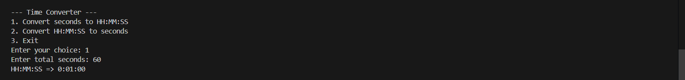
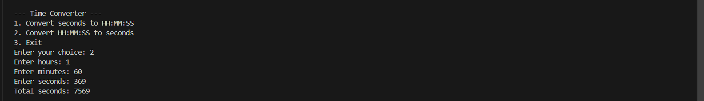
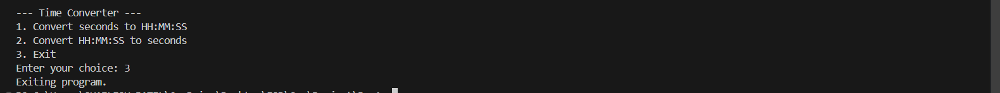

<h1 align="center">Time Converter_C++</h1>
 

<h3 align="center">This project aims to develop a utility program in C++ that handles time conversion. We’ll create
a class: TimeConverter. The class will be used for relevant functionality and objects of this class
will be used to perform specific tasks. A menu-driven approach will be used to provide the
choices to the user whether to convert from seconds to HH:MM:SS or vice versa.</h3>
 

<h1 align="center">Convert seconds to HH:MM:SS</h1>
 

 

<h1 align="center">Convert HH:MM:SS to seconds</h1>
 

 

<h1 align="center">Exit</h1>
 

 

